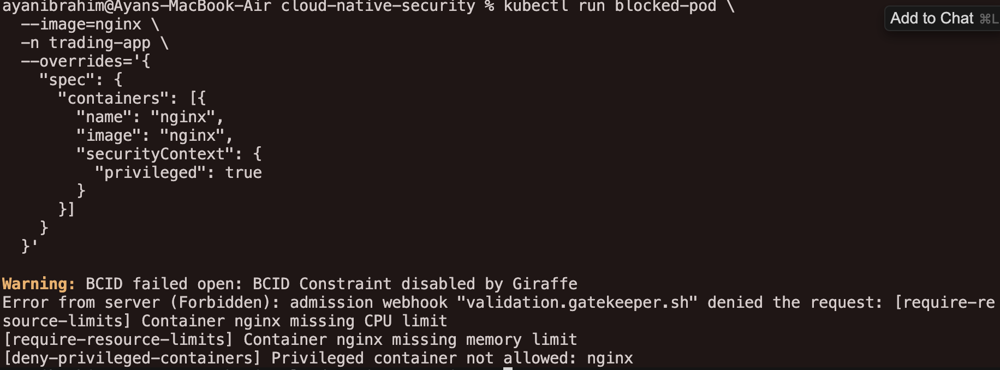
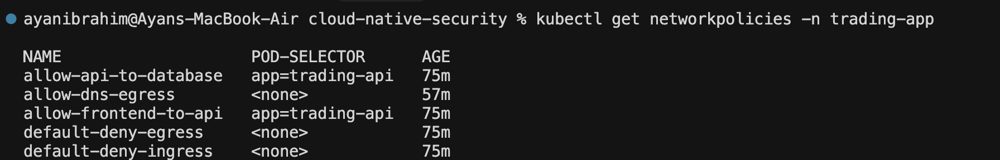
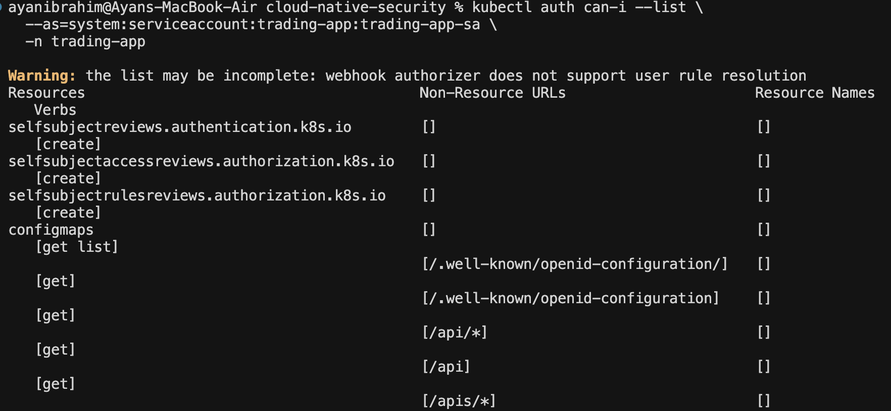
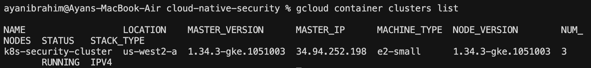

# Cloud-Native Security Project

## Overview

This project demonstrates an end-to-end implementation of **cloud-native security** for a microservices-based application running on Kubernetes. It applies **defence-in-depth** principles across the full container lifecycle, from pre-deployment scanning to runtime threat detection and admission-time policy enforcement.

The project is implemented as a practical **DevSecOps security lab** using **Google Kubernetes Engine (GKE)** and focuses on identifying, exploiting, detecting, and preventing common Kubernetes security risks using industry-standard tools.

**Security tools used:**

* **Trivy** – container image and configuration vulnerability scanning
* **Falco** – runtime threat detection using eBPF
* **OPA Gatekeeper** – policy-as-code and admission control

The scenario is based on a fictional organisation, **CloudNative Finance**, operating a high-availability trading platform that processes sensitive financial and user data.

---

## Project Objectives

The objectives of this project are to:

* Simulate realistic Kubernetes security misconfigurations
* Identify risks before deployment using static scanning
* Detect runtime threats occurring inside containers
* Enforce preventive security controls at admission time
* Demonstrate how layered security tools work together in a DevSecOps workflow

---

## CloudNative Finance Scenario

CloudNative Finance deploys the following services into Kubernetes:

* Trading API (high-frequency financial transactions)
* User authentication service
* Market data aggregator
* Portfolio management service
* PostgreSQL database
* Redis cache

These services process sensitive financial and user data, making confidentiality, integrity, availability, and compliance critical security requirements.

---

## Threat Landscape

Key risks addressed in this project include:

* Vulnerable and outdated container images
* Privileged or misconfigured pods
* Excessive Kubernetes RBAC permissions
* Runtime threats such as unauthorised shell access
* Sensitive file access and credential exposure
* Post-exploitation and insider misuse

This project follows the **4Cs of cloud-native security**:

**Code → Containers → Cluster → Cloud**

---

## Architecture & Environment

* **Cloud Provider:** Google Cloud Platform (GCP)
* **Kubernetes:** Google Kubernetes Engine (GKE)
* **Runtime Monitoring:** Falco (eBPF)
* **Policy Enforcement:** OPA Gatekeeper
* **Scanning Tools:** Trivy

### Namespaces

* `vulnerable-apps` – intentionally insecure workloads
* `security-tools` – Falco, Falcosidekick, OPA Gatekeeper
* `gatekeeper-system` – Gatekeeper controllers and audit pods
* `trading-app` – application workloads used for network policy and RBAC testing

---

## Security Tool Stack

### Trivy – Container & Configuration Security

Trivy was used to scan:

* Container images for known CVEs
* Kubernetes manifests for misconfigurations
* Files and manifests for exposed secrets

Example scans:

```bash
trivy image nginx:1.14.0
trivy config ./k8s
```

This enabled early detection of security issues **before workloads were deployed**. Scan results were analysed to understand severity levels, affected packages, fixed versions, and attack surface reduction strategies.

---

## OPA Gatekeeper – Preventive Policy Enforcement

OPA Gatekeeper was used to enforce security policies at Kubernetes admission time, preventing insecure workloads from being created in the cluster.

Unlike Trivy (pre-deployment scanning) and Falco (runtime detection), Gatekeeper provides **preventive controls** by blocking misconfigurations before they reach runtime.

### Enforced Policies

The following policies were implemented using ConstraintTemplates and Constraints:

* **Deny Privileged Containers**

  * Blocks Pods attempting to run containers with `securityContext.privileged: true`
* **Require Resource Limits**

  * Enforces CPU and memory limits on all containers

Policies were applied using:

```bash
kubectl apply -f policies/templates/
kubectl apply -f policies/constraints/
```

### Policy Enforcement Verification

When attempting to deploy a privileged container without resource limits, the deployment was blocked:

* Admission webhook denied the request
* Privileged container was rejected
* Missing CPU and memory limits were reported

This confirms that Gatekeeper policies were active and correctly enforced.

---

## Kubernetes Security Misconfigurations

To simulate real-world attack scenarios, several intentionally vulnerable resources were deployed:

* **Privileged Pod** – running with elevated privileges
* **Insecure RBAC** – overly permissive ClusterRoleBinding
* **Exposed Secrets** – plaintext credentials stored in Kubernetes Secrets
* **Vulnerable Deployment** – outdated container image (`nginx:1.14.0`)

These workloads were later used to demonstrate both runtime detection and admission-time policy enforcement.

---

## 🔒 Kubernetes Network Security – Zero Trust Networking

To implement zero-trust networking, Kubernetes NetworkPolicies were applied to restrict pod-to-pod communication within the cluster.

By default, Kubernetes allows all traffic. This project enforces a **default-deny** strategy and explicitly allows only required communication paths.

### Implemented Network Policies

**Default Deny (Ingress & Egress)**

* Blocks all inbound and outbound traffic by default

**Explicit Allow Rules**

* Frontend → Trading API (TCP 8080)
* Trading API → PostgreSQL (TCP 5432)
* DNS egress (UDP 53)

Network policy manifests are stored under:

```text
k8s/
├── default-deny.yaml
├── allow-api-traffic.yaml
├── allow-dns-egress.yaml
```

Policies were applied using:

```bash
kubectl apply -f k8s/default-deny.yaml
kubectl apply -f k8s/allow-api-traffic.yaml
kubectl apply -f k8s/allow-dns-egress.yaml
```

Network isolation was validated using a test pod, confirming that application traffic remains blocked unless explicitly permitted.

---

## Runtime Threat Detection with Falco

Falco was deployed as a DaemonSet in the `security-tools` namespace, providing node-level visibility across the cluster.

### Triggered Runtime Security Event – Shell Access

An interactive shell was executed inside a running container:

```bash
kubectl exec -it -n vulnerable-apps \
$(kubectl get pod -n vulnerable-apps -l app=vulnerable-app -o jsonpath='{.items[0].metadata.name}') \
-- /bin/sh
```

Falco generated an alert with the following details:

* **Rule:** Terminal shell in container
* **Priority:** Notice
* **User:** root
* **Namespace:** vulnerable-apps
* **Container Image:** nginx:1.14.0
* **MITRE ATT&CK:** T1059 – Command and Scripting Interpreter

This demonstrates Falco’s ability to detect common post-exploitation techniques.

### Falco Log Monitoring

```bash
kubectl logs -n security-tools -l app.kubernetes.io/name=falco -f
```

This provided real-time visibility into runtime security events.

---

## Kubernetes RBAC – Least Privilege Enforcement

Kubernetes Role-Based Access Control (RBAC) was used to restrict permissions following the principle of least privilege.

An intentionally overprivileged ClusterRoleBinding was identified and removed.

A least-privilege Role and RoleBinding were created for the trading application, granting access only to required resources within its namespace.

Permissions were verified using:

```bash
kubectl auth can-i --list \
--as=system:serviceaccount:trading-app:trading-app-sa \
-n trading-app
```

This confirmed that the service account had significantly reduced permissions compared to cluster-admin access.

---

## Issues Faced & Resolutions

Several real-world challenges were encountered during implementation:

### Gatekeeper Resource Constraints

Gatekeeper audit functionality was limited due to GCP regional CPU and disk quota restrictions.

**Resolution:**

* Validated ConstraintTemplates and admission webhooks
* Continued admission control testing despite audit limitations

### ConstraintTemplate vs Constraint Ordering

Initial policy application failed due to incorrect application order.

**Resolution:**

* Applied ConstraintTemplates first
* Applied Constraints after CRDs were registered
---
## Limitations

* The GKE cluster was constrained by regional quota limits
* Gatekeeper audit functionality was limited by cluster size
* This project focuses on security controls and does not represent a production-hardened environment
---
## Evidence & Cleanup Note

All security controls were successfully implemented and validated. The GKE cluster was intentionally deleted after testing to avoid unnecessary cloud charges.

Evidence for this project includes:

* Trivy scan reports
* Gatekeeper constraint outputs
* Network policy manifests
* RBAC audit exports
* GKE Cluster
* Falco alert logs

### 📸 Evidence Screenshots

#### Trivy Vulnerability Scan


#### OPA Gatekeeper Blocking Privileged Pod


#### Kubernetes Network Policies


#### RBAC Least Privilege


#### GKE Cluster (Running)



### Falco Runtime Alert Evidence

Falco successfully detected runtime threats during testing, including
interactive shell access inside a running container.

Due to cluster teardown after validation (to avoid cloud charges),
screenshots of live Falco logs were not captured. However, the alerts
were verified directly via `kubectl logs` and are documented below.

#### Example Falco Alert Output
```json
{
  "rule": "Terminal shell in container",
  "priority": "Notice",
  "user.name": "root",
  "container.image.repository": "docker.io/library/nginx",
  "container.image.tag": "1.14.0",
  "k8s.ns.name": "vulnerable-apps",
  "source": "syscall"
}
---
 ```bash
**Conclusion**

This project demonstrates a practical, end-to-end approach to cloud-native security by combining:

* **Preventive controls** (OPA Gatekeeper)
* **Pre-deployment scanning** (Trivy)
* **Runtime threat detection** (Falco)

By integrating these tools into a single Kubernetes environment, the project illustrates how defence-in-depth principles can be applied across the full container lifecycle while reflecting real-world DevSecOps challenges and constraints.
```